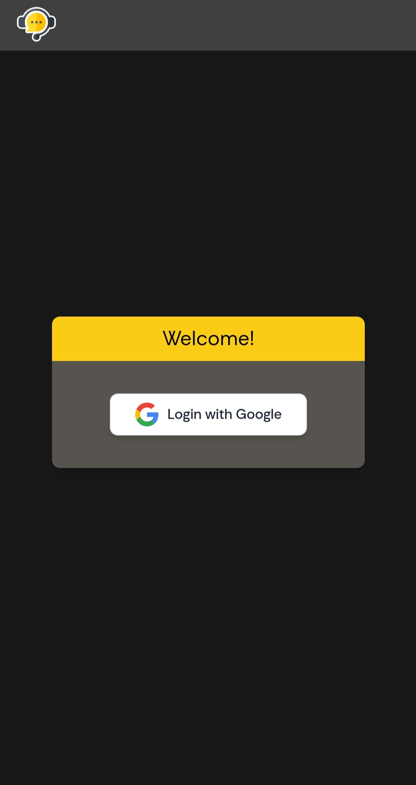
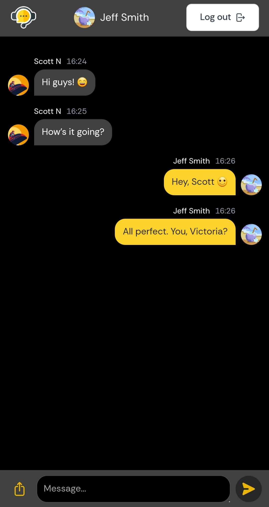
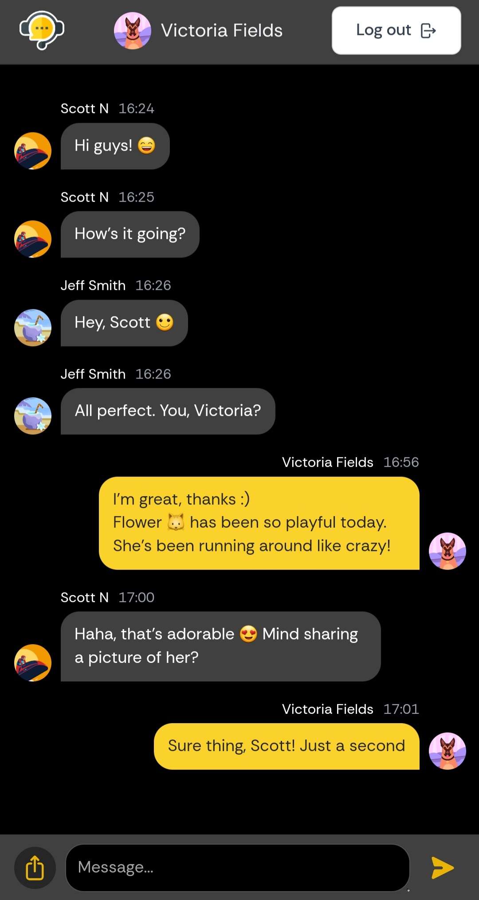
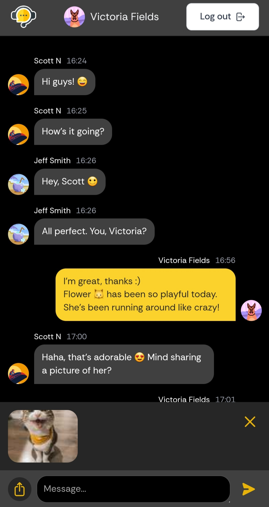
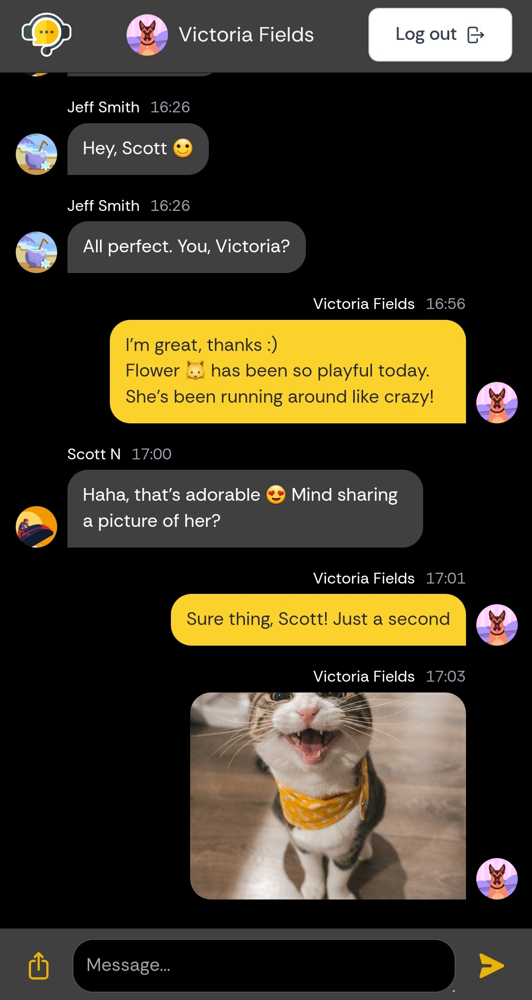
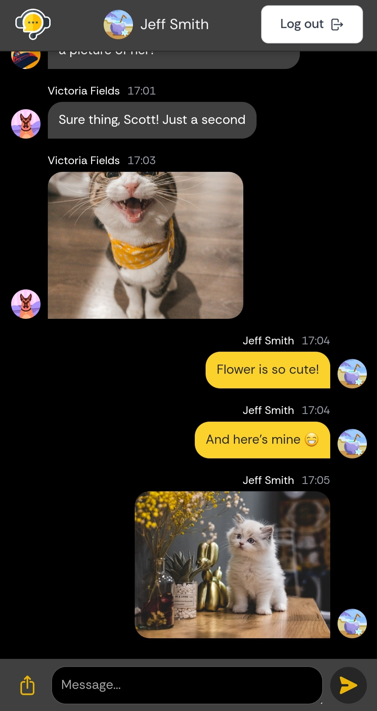

# Full-Stack Chat App with React & Firebase

<!-- TODO -->
> :speech_balloon: На русском:
> 
> 

> [!IMPORTANT]
> The app is **live** on [Firebase](https://firebase.google.com/). Feel free to **experience** the app **firsthand** by following the link: [Chat App](https://chat-app-demo-17b82.firebaseapp.com/).

> [!WARNING]  
> **Please refrain from sending spam messages** on this app. **Any misuse** of the chat feature **may result in the suspension** of your account. Let's keep the conversation respectful for everyone. Thank you for your cooperation! 

<!-- TABLE OF CONTENTS -->

  
Table of Contents

  <ol>
    <li>
      <a href="#about-the-project">About the Project</a>
      <ul>
        <li><a href="#key-features-include">Key Features Include</a></li>
        <li><a href="#built-with">Built With</a></li>
        <li><a href="#deployed-with">Deployed With</a></li>
      </ul>
    </li>
    <li><a href="#usage">Usage</a></li>
    <li><a href="#license">License</a></li>
    <li><a href="#acknowledgments">Acknowledgments</a></li>
  </ol>

&nbsp;

<!-- ABOUT THE PROJECT -->
## About the Project

:iphone: *Chat App* :iphone: is a full-stack web application built for real-time communication between users in a shared chat room. It uses Google authentication for quick and easy login.  

&nbsp; 

### Key Features Include

:zap: **Sign in with your Google account**.

:zap: **Send and receive text messages**. 

:zap: **Share images**. 

> See <a href="#usage">Usage</a> for detailed information.

&nbsp;

### Built With

:zap: **Frontend**
* HTML, CSS, JavaScript 
* [React](https://react.dev/)
* [Vite](https://vitejs.dev/)
* [Tailwind](https://tailwindcss.com/)
* [Redux Toolkit](https://redux-toolkit.js.org/)

:zap: **Backend**
* JavaScript
* [Firebase](https://firebase.google.com/) (Authentication, Firestore Database, Storage)

&nbsp;

### Deployed With

**Frontend and Backend**: [Firebase Hosting](https://firebase.google.com/docs/hosting)

> See <a href="#acknowledgments">Acknowledgments</a> for more information.

&nbsp;

<!-- USAGE -->
## Usage

### :large_blue_circle: Log In

You can sign in securely using your Google account.
:grey_exclamation: Only **authenticated** users can access the chat as the app utilizes private routes.

---

### :large_blue_circle: Send Text Messages

You can view and participate in real-time conversations. 
**Messages are instantly synchronized**. Each message includes the sender's name, their profile image, message content, and timestamp.

---

### :large_blue_circle: Share Images

You can upload images directly from your device and share them within the chat.
Image thumbnails are displayed before sending. The uploaded images are stored securely in Firebase Cloud Storage. 

&nbsp;

## License
Distributed under the MIT License. 
> See <a href="https://github.com/elizaveta-sm/chat-app-demo/blob/main/LICENSE.md">LICENSE.md</a> for more information.

&nbsp;

## Acknowledgments
 
:gem: [React Router](https://reactrouter.com/en/main)

:gem: [react-image-file-resizer](https://www.npmjs.com/package/react-image-file-resizer)

:gem: [react-lazyload](https://www.npmjs.com/package/react-lazyload)

:gem: [uuid](https://www.npmjs.com/package/uuid)

