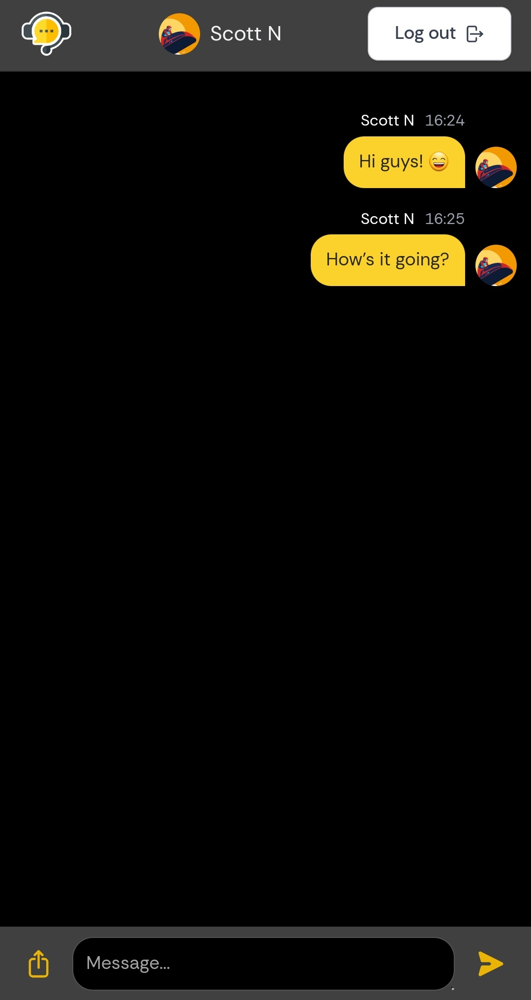
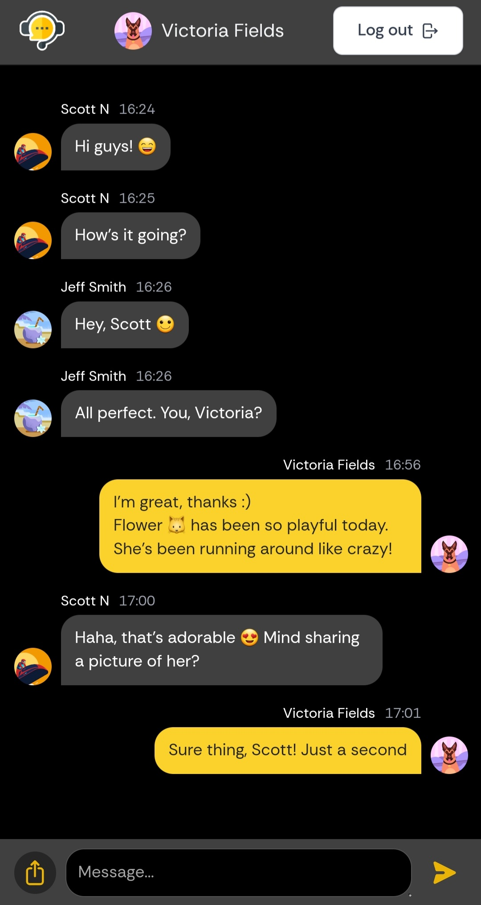

# Полностековое веб-приложение для чата с использованием React и Firebase

> [!IMPORTANT]
> Веб-приложение **выложено в интернет** с помощью [Firebase](https://firebase.google.com/) и в настоящее время **доступно для пользователей**. **Протестируйте** приложение самостоятельно, перейдя по ссылке: [Chat App](https://chat-app-demo-17b82.firebaseapp.com/).

> [!WARNING]  
> Пожалуйста, **воздержитесь от отправки спам-сообщений** в этом веб-приложении. **Любое злоупотребление** функцией чата **может привести к приостановке** вашей учетной записи. Давайте поддерживать диалог с уважением ко всем. Спасибо вам за сотрудничество!

<!-- ОГЛАВЛЕНИЕ -->

  
Содержание

  <ol>
    <li>
      <a href="#о-проекте">О проекте</a>
      <ul>
        <li><a href="#основной-функционал">Основной функционал</a></li>
        <li><a href="#создано-с-использованием">Создано с использованием</a></li>
        <li><a href="#размещено-с-использованием">Размещено с использованием</a></li>
      </ul>
    </li>
    <li><a href="#использование-веб-приложения">Использование веб-приложения</a></li>
    <li><a href="#лицензия">Лицензия</a></li>
    <li><a href="#отдельные-благодарности">Отдельные благодарности</a></li>
  </ol>

&nbsp;

<!-- О ПРОЕКТЕ -->
## О проекте

:iphone:**Chat App**:iphone: - это веб-приложение полного стека, созданное для общения пользователей в **режиме реального времени** в общем чате. Оно **использует аутентификацию Google** для быстрого и удобного входа в систему.

&nbsp; 

### Основной функционал

:zap: Войдите в свой Google аккаунт.

:zap: Отправляйте и получайте текстовые сообщения. 

:zap: Делитесь изображениями.

> См. <a href="#использование-веб-приложения">Использование веб-приложения</a></li> для более подробной информации.

&nbsp; 

### Создано с использованием

:zap: **Фронтенд**
* HTML, CSS, JavaScript 
* [React](https://react.dev/)
* [Vite](https://vitejs.dev/)
* [Tailwind](https://tailwindcss.com/)
* [Redux Toolkit](https://redux-toolkit.js.org/)
  
:zap: **Бэкенд**
* JavaScript
* [Firebase](https://firebase.google.com/) (Authentication, Firestore Database, Storage)

&nbsp; 

### Размещено с использованием

:zap: **Frontend and Backend**: [Firebase Hosting](https://firebase.google.com/docs/hosting)

> См. <a href="#отдельные-благодарности">Отдельные благодарности</a> для получения дополнительной информации.

&nbsp;

<!-- ИСПОЛЬЗОВАНИЕ -->
## Использование веб-приложения

### :large_blue_circle: Вход в систему

Вы можете безопасно войти в систему, используя свою учетную запись Google.

:memo: Только **аутентифицированные** пользователи могут получить доступ к чату, поскольку приложение использует частные маршруты.

---

### :large_blue_circle: Отправка текстовых сообщений

Вы можете просматривать переписку в режиме реального времени и участвовать в ней.
**Сообщения мгновенно синхронизируются**. Каждое сообщение содержит имя отправителя, изображение его профиля, содержание сообщения и временную метку.

---

### :large_blue_circle: Обмен изображениями

Вы можете загружать изображения непосредственно с вашего устройства и делиться ими в чате.
Миниатюры изображений отображаются перед отправкой. Загруженные изображения надежно хранятся в облачном хранилище Firebase.

&nbsp;

## Лицензия

Распространяется под лицензией MIT.
> См. <a href="https://github.com/elizaveta-sm/chat-app-demo/blob/main/LICENSE.md">LICENSE.md</a> для получения дополнительной информации.

&nbsp;

## Отдельные благодарности
 
:gem: [React Router](https://reactrouter.com/en/main)

:gem: [react-image-file-resizer](https://www.npmjs.com/package/react-image-file-resizer)

:gem: [react-lazyload](https://www.npmjs.com/package/react-lazyload)

:gem: [uuid](https://www.npmjs.com/package/uuid)